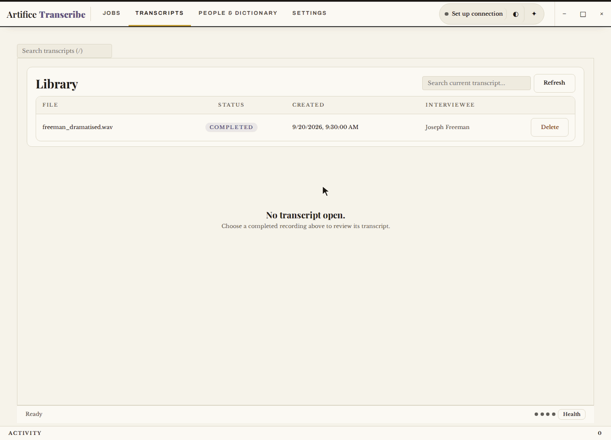

<p align="center">
  
</p>

<h1 align="center">Artifice Transcribe</h1>

<p align="center">
  <a href="https://github.com/MauriceJCasey/artifice-transcribe/actions/workflows/safety-tests.yml"></a>
  <a href="https://api.reuse.software/info/github.com/MauriceJCasey/artifice-transcribe"></a>
  <a href="LICENSE"></a>
  
</p>

A local-first transcription tool for oral history and interviews, with speaker diarization.

Artifice Transcribe turns an audio or video recording into an editable, speaker-labelled
transcript, using [WhisperX](https://github.com/m-bain/whisperX) for speech recognition and
[pyannote.audio](https://github.com/pyannote/pyannote-audio) to tell speakers apart. You review
it against the audio, name the speakers, add the interview's metadata, and export it in the
formats archives use.

Everything runs on your own machine. Audio never leaves it.

**⚠️ Active development, early stage.** Expect rough edges. This is for people comfortable
troubleshooting local models.

## What it does

- **Transcription.** Whisper, from tiny to large-v3, with word-level timestamps. NVIDIA Parakeet
  is available as an English-only alternative on CUDA.
- **Speakers.** Detects who spoke when. Name a speaker once and the name applies throughout;
  enrol known voices to recognise them in later interviews.
- **Review.** The transcript plays in sync with the audio. Correct any segment in place, compare
  against the original with a diff, and step back through each segment's edit history.
- **Vocabulary.** A persistent dictionary of names, places and terms steers every future run.
- **Metadata.** Interviewee, interviewer, date, location, project, collection ID and access
  restrictions travel with each transcript.
- **Export.** OHMS XML, TEI XML, SRT, VTT, JSON, Markdown, PDF and plain text.
- **Optional text tools.** Connect Ollama, LM Studio or anything OpenAI-compatible to summarise
  or clean up a finished transcript. This never touches transcription itself.

<p align="center">
  
</p>

## Download

Windows and Linux builds are attached to each
[release](https://github.com/MauriceJCasey/artifice-transcribe/releases/latest). They are not
code-signed yet.

**The download does not include the speech-recognition stack.** WhisperX and PyTorch are several
gigabytes and cannot be added to a portable build, so the download cannot transcribe new
recordings by itself. It runs the whole interface: the library, review against audio, speaker
naming, editing, the dictionary and every export. To transcribe, use the source install below.

**Windows 10 or 11**

1. Download `artifice-transcribe-Windows-*.zip`, right-click it and choose **Extract All**. Keep
   the extracted folder together: the app needs the files beside it.
2. Open `artifice-transcribe.exe`. Windows SmartScreen will say it "protected your PC" because the
   build is unsigned: choose **More info**, then **Run anyway**.
3. The app opens in its own window, and closing the window quits it.

**Linux (x86-64)**

```bash
mkdir artifice-transcribe && tar -xzf artifice-transcribe-Linux-*.tar.gz -C artifice-transcribe
cd artifice-transcribe && ./artifice-transcribe
```

This opens `http://localhost:8000` in your browser; press Ctrl+C in the terminal to stop it. A
portable Linux build cannot bundle the system GTK libraries a native window uses, so it runs in
the browser.

**macOS** has no download yet: macOS will not open an unsigned app without extra steps, so use the
source install below.

## Run from source

```bash
uv sync --extra transcribe --extra asr   # use --extra asr-cuda for an NVIDIA GPU
uv run artifice-transcribe
```

This opens a local web interface at `http://localhost:8000`. Models download on first use.
pyannote's speaker models are gated on Hugging Face: accept their terms there, then add your
token in **Settings**.

## License

AGPL-3.0-or-later. See [LICENSE](LICENSE).

<details>
<summary>Dependencies</summary>

<!-- BEGIN GENERATED DEPENDENCIES (see scripts/export-to-public-repos.sh) -->
## Dependencies

This list is generated directly from [`apps/artifice-transcribe/pyproject.toml`](apps/artifice-transcribe/pyproject.toml), the actual `dependencies`/`optional-dependencies` tables, not hand-maintained. `.github/workflows/dependency-guard.yml` fails the build if `uv.lock` ever drifts from this file, so any dependency change (including an unreviewed addition) shows up as an explicit, reviewable diff.

**Core:**

- `fastapi>=0.115.0`
- `uvicorn[standard]>=0.30.0`
- `sqlalchemy[asyncio]>=2.0.0`
- `aiosqlite>=0.20.0`
- `pydantic>=2.0.0`
- `pydantic-settings>=2.0.0`
- `python-multipart>=0.0.9`
- `platformdirs>=4.0.0`
- `fpdf2>=2.8.0`
- `openai>=1.0.0`
- `jinja2>=3.0`
- `artifice-model-harness>=0.2.0`
- `numpy>=1.26`
- `artifice-secure-io>=0.2.0`
- `artifice-shared-ui>=0.2.0`
- `artifice-output-layout>=0.1.0`

**`asr` extra:**

- `whisperx>=3.8.0`
- `torch>=2.8.0,<2.9.0`
- `torchaudio>=2.8.0,<2.9.0`
- `torchvision>=0.23.0,<0.24.0`
- `torchcodec>=0.11.0,<0.12.0`
- `pyannote.audio>=4.0`
- `transformers>=4.0`

**`asr-cuda` extra:**

- `whisperx>=3.8.0`
- `torch>=2.8.0,<2.9.0`
- `torchaudio>=2.8.0,<2.9.0`
- `torchvision>=0.23.0,<0.24.0`
- `torchcodec>=0.11.0,<0.12.0`
- `pyannote.audio>=4.0`
- `transformers>=4.0`

**`asr-parakeet` extra:**

- `nemo_toolkit[asr]>=2.7.3`

**`window` extra:**

- `pywebview>=5.0`

For the complete resolved dependency tree (including transitive dependencies), see `uv.lock` at the repo root, or run `uv tree`.
<!-- END GENERATED DEPENDENCIES -->

</details>
